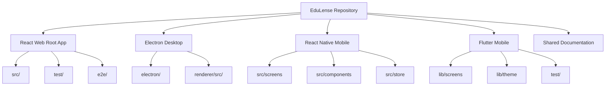
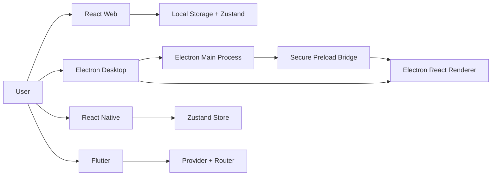
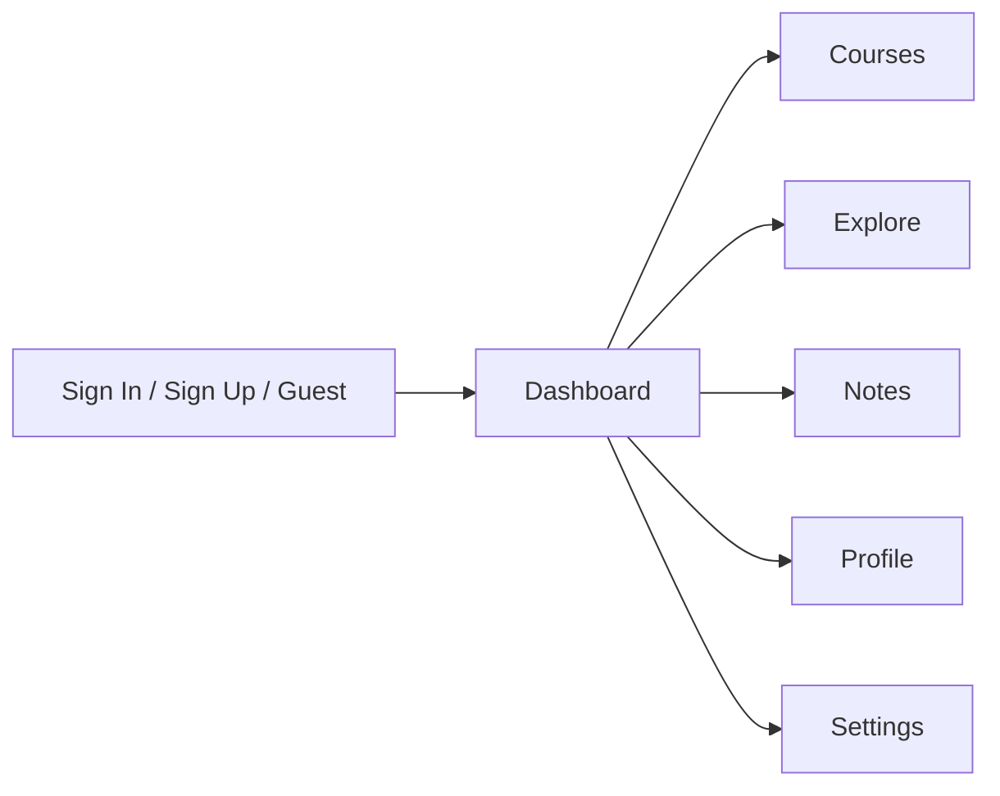

# Architecture Overview

## Product Architecture Summary

EduLense is not a single app with thin wrappers. It is a product family with four first-class clients that share user journeys and accessibility goals while using platform-appropriate runtime models.

## Repository Topology

## Runtime Architecture

## Platform Architecture Details

### React Web

- stack: React 19, Vite, React Router, Zustand, Vitest, Playwright
- entry: `src/main.tsx`
- route shell: `src/App.tsx`
- app state: `src/state/useAppStore.ts`
- features: browser-first responsive shell and local-first persisted workflows

### Electron Desktop

- stack: Electron, Vite renderer, React, Jest
- main process: `edulence_desktop/electron/main.js`
- preload bridge: `edulence_desktop/electron/preload.js`
- renderer: `edulence_desktop/renderer/src/App.jsx`
- features: native menus, dialogs, file access, tray integration, update flow support

### React Native

- stack: Expo SDK 53, React Native 0.79, React Navigation, Zustand, Jest
- navigation: `edulence_rn/src/navigation/AppNavigator.tsx`
- state: `edulence_rn/src/store/useAppStore.ts`
- theme: `edulence_rn/src/theme/`
- features: native mobile navigation, accessibility labels, Expo/EAS release workflows

### Flutter

- stack: Flutter, Material 3, `go_router`, `provider`
- entry: `edulence/lib/main.dart`
- screens: `edulence/lib/screens/`
- theme: `edulence/lib/theme/theme.dart`
- features: Flutter-native semantics, widget tests, Android/iOS/mobile packaging

## Shared Product Concepts

Each implementation supports the same high-level product flow:

## Security And Trust Boundaries

### Browser And Mobile

- largely local-first state
- no shared production backend contract documented in this repository
- demo or local account/state handling dominates current implementation

### Electron

- `contextIsolation: true`
- `sandbox: true`
- `nodeIntegration: false`
- privileged operations exposed only through the preload bridge and validated IPC

## Accessibility Architecture

- shared preference model across implementations: theme, contrast, large text, handedness
- automated accessibility-related test coverage exists in web, React Native, desktop, and Flutter
- manual accessibility evidence exists in repository screenshots and desktop screen-reader notes
