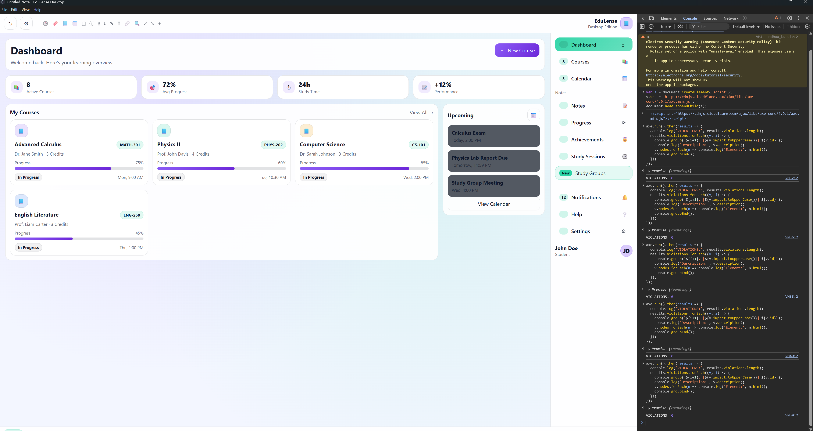
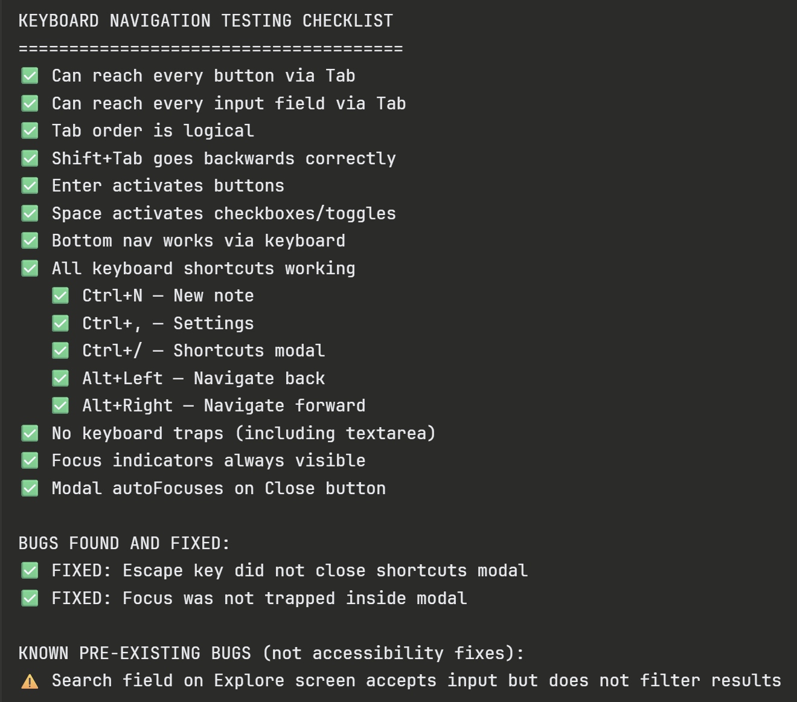
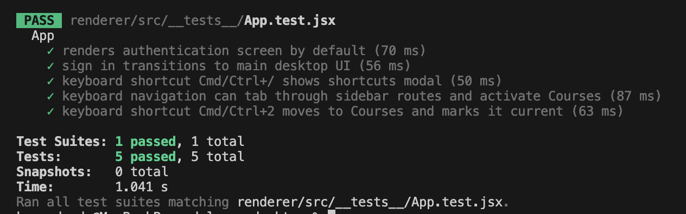

# Accessibility Features Guide

## Accessibility Goals

EduLense is designed to be usable across browser, desktop, and mobile environments with a consistent emphasis on readability, keyboard support, screen-reader semantics, and adaptable presentation.

## User-Visible Accessibility Features

### Theme Modes

- light mode
- dark mode
- system mode where supported

These help users match ambient lighting and platform preferences.

### High Contrast

High contrast increases separation between foreground and background colors for users who need stronger visual distinction.

### Large Text

Large text improves readability for low-vision users and users who prefer larger typography.

### Left-Handed Mode

Left-handed mode adjusts layout emphasis and interaction comfort for users who prefer left-side reach patterns.

### Screen Reader Labels

Interactive controls are labeled so assistive technologies can announce:

- the control name
- the role
- the state when applicable

### Keyboard Navigation

The desktop and web experiences support keyboard-first movement through core controls. The Flutter app also includes keyboard-navigation-focused widget tests for key flows.

## Accessibility Evidence Included In This Package

### Axe browser validation evidence

### Keyboard navigation checklist

### Keyboard verification evidence

## How To Enable Accessibility Preferences

1. Open `Settings`.
2. Open the appearance or accessibility area for the platform.
3. Toggle:
   - `Large Text`
   - `High Contrast`
   - `Left-Handed Mode`
   - theme mode selection

## Recommended Combinations

- Low-light use: `Dark Mode`
- Low vision: `Large Text` + `High Contrast`
- One-handed left-side use: `Left-Handed Mode`

## Known Accessibility Limitations

- Accessibility validation is strongest in the implemented core flows and shared shell experiences.
- Some placeholder or demo-only views may require additional manual assistive technology checks before release.
- Screen-reader validation evidence in the repo is strongest for desktop and browser flows; wider device-matrix validation is still recommended.

## If You Need More Help

If a control is hard to find or operate:

1. turn on `Large Text`
2. turn on `High Contrast`
3. try keyboard navigation on web or desktop
4. review the troubleshooting guide in [FAQ_AND_TROUBLESHOOTING.md](/Users/kwameduodu/EduLense/EduLense/Complete%20Documentation/User%20Documentation/FAQ_AND_TROUBLESHOOTING.md)
