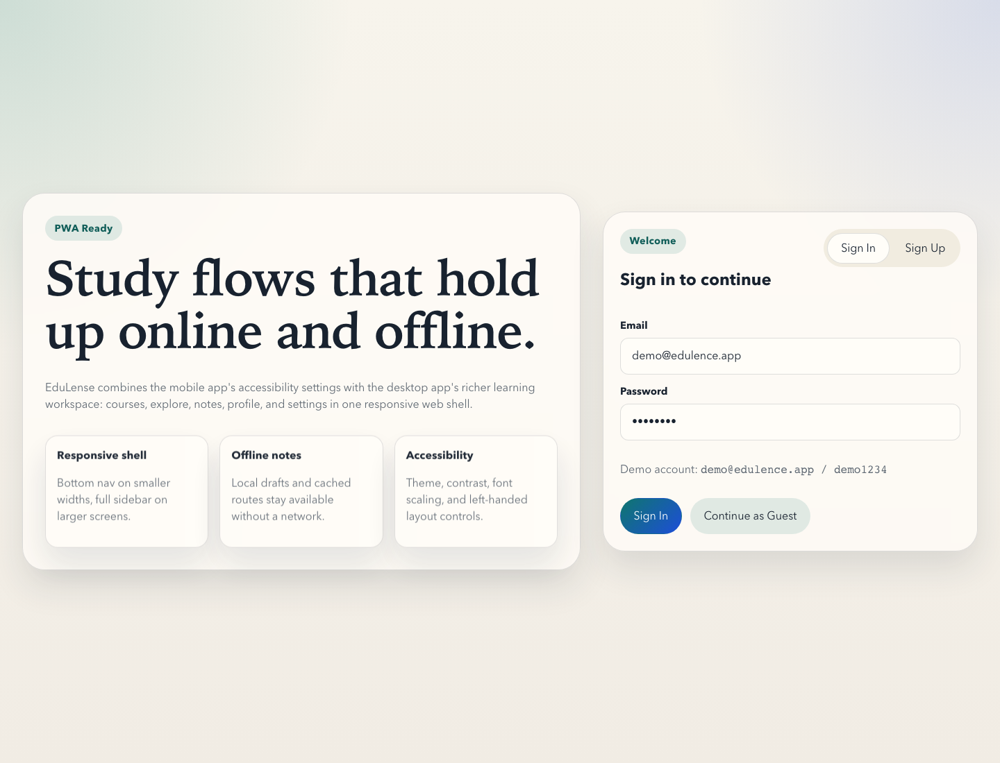
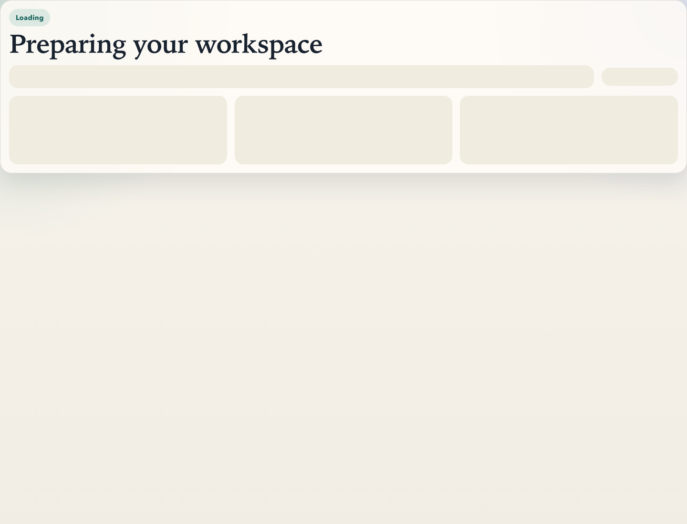

# User Guide

## Overview

EduLense is a multi-platform learning workspace for students and instructors. The experience is intentionally consistent across browser, desktop, and mobile so users can sign in, review study activity, explore courses, manage notes, and adjust accessibility preferences on the platform that fits their workflow.

## Screenshots

### Sign-in experience

The sign-in screen provides:

- `Sign In` and `Sign Up` modes
- guest access for quick evaluation flows
- feature highlights for offline notes, responsive layout, and accessibility settings

### Dashboard experience

The dashboard provides:

- a quick summary of learning activity
- direct shortcuts to courses, notes, explore, profile, and settings
- a shared layout model that adapts for desktop, web, and mobile form factors

## First-Time Use

1. Launch EduLense on your preferred platform.
2. Choose `Sign In`, `Sign Up`, or continue as a guest where supported.
3. Land on the dashboard.
4. Use navigation to move to `Courses`, `Explore`, `Notes`, `Profile`, and `Settings`.
5. Open `Settings` early to configure theme, text size, contrast, and handedness preferences.

## Main User Workflows

### Authentication

- Sign in with existing demo or local account credentials.
- Create a new account from the sign-up flow.
- Continue as a guest for quick evaluation or classroom demonstration.

### Dashboard

- Review your current learning overview.
- Open notes quickly.
- jump to courses and active study workflows.

### Courses

- review courses already in your workspace
- add a new course in platforms that expose course-creation workflows
- inspect progress and key metadata

### Explore

- browse sample learning content
- inspect recommended or mock course offerings
- filter and select content to review

### Notes

- create notes
- rename and edit notes
- keep drafts local for offline-friendly workflows

### Profile

- review the current signed-in or guest user context
- sign out when you are finished

### Settings

- switch between light, dark, and system theme modes
- enable left-handed mode
- enable large text
- enable high contrast

## Platform Behavior Summary

- React web: best for browser-based access and quick deployment
- Electron desktop: best for desktop shell features like menus, dialogs, file actions, and update workflows
- React Native mobile: best for native mobile navigation and Expo/EAS delivery
- Flutter mobile: best for Flutter-based cross-platform packaging and Material 3 implementation

## Recommended Usage Tips

- Use desktop or web when you need a larger notes workspace.
- Use mobile when you need quick course access and settings on the go.
- Turn on `Large Text` and `High Contrast` together for maximum readability.
- Turn on `Left-Handed Mode` if you prefer action placement aligned to left-hand reach.
